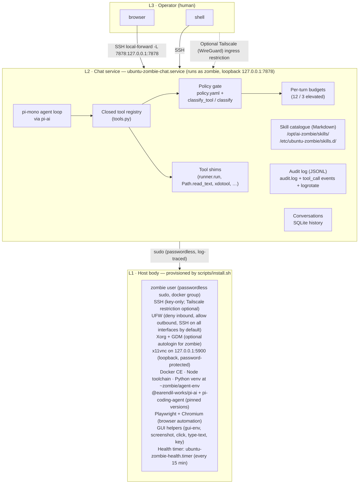
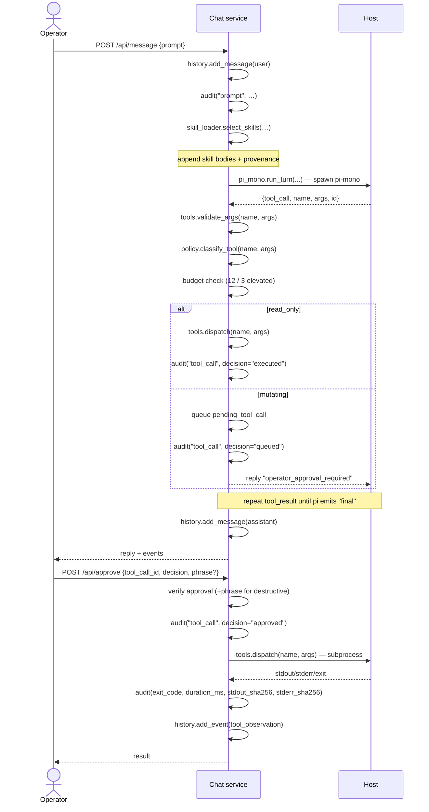
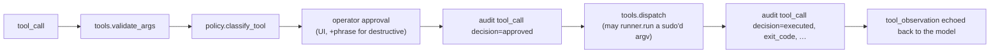

# Architecture

Ubuntu Zombie turns an Ubuntu Desktop LTS PC into a workstation with a
resident AI Systems Administrator. The whole product is deliberately
small enough to fit in one head: a single installer, a single
uninstaller, one privileged user account, one loopback HTTP service,
one policy file, one closed tool registry, one audit log.

This document is the canonical map of what the system *is* — every
component, file, boundary, and lifecycle — and how the pieces fit
together. It is kept in lockstep with `scripts/` and `payload/`; if
the code and this document disagree, the code is right and this
document is a bug.

---

## 1. System overview

Ubuntu Zombie has **three layers** that talk to each other over
well-defined, narrow interfaces:



Each layer is owned by a different principal:

| Layer | Principal | Trust |
|-------|-----------|-------|
| L3 Operator | the human | full |
| L2 Chat service | `zombie` user (unprivileged, with `sudo` allow-list) | gated by `policy.yaml` + closed tool registry |
| L1 Host body | `root` (only at install/uninstall/upgrade time) | bounded by `install.sh` |

There is **no remote API surface**. The chat UI binds to `127.0.0.1`
only; the only way in from another machine is an SSH tunnel over
key-only SSH (optionally restricted to Tailscale), and the only way
`root` is exercised is by an operator running `scripts/install.sh` or
`scripts/uninstall.sh`.

The model never emits free-form shell. Every action it takes is a
structured **tool call** against the closed registry in
`payload/agent/tools.py`. Adding a tool requires a code release —
skills, prompts, and policy edits cannot expand the surface.

---

## 2. Repository layout

The shipped source tree is intentionally flat:

```
ubuntu-zombie/
├── scripts/                          # operator-run, root-required
│   ├── install.sh                    # installer + verify/doctor/repair
│   └── uninstall.sh                  # reverse the installer
├── payload/                          # files copied verbatim to disk
│   ├── agent/                        # → /opt/ai-zombie/agent/
│   │   ├── server.py                 # HTTP server + tool-call lifecycle
│   │   ├── providers.py              # pi-ai bridge wrapper (chat surface)
│   │   ├── pi_mono.py                # pi-mono bridge driver (agent loop)
│   │   ├── pi-ai-bridge.mjs          # Node bridge for @earendil-works/pi-ai
│   │   ├── pi-ai.version             # pinned pi-ai version
│   │   ├── pi-mono-bridge.mjs        # Node bridge for pi-coding-agent
│   │   ├── pi-mono.version           # pinned pi-coding-agent version
│   │   ├── tools.py                  # closed tool registry + shims
│   │   ├── policy.py                 # YAML reader + classify / classify_tool
│   │   ├── skill_loader.py           # markdown skill discovery + selection
│   │   ├── skills/                   # → /opt/ai-zombie/skills/  (root-owned)
│   │   │   ├── apt.md  docker.md  gui.md
│   │   │   ├── systemd.md  tailscale.md  ufw.md
│   │   ├── runner.py                 # subprocess wrapper + follow-ups
│   │   ├── audit.py                  # JSONL writer + redactor + tool_call events
│   │   ├── history.py                # SQLite conversations / messages / events
│   │   ├── examples.md               # prompt library shown in the UI
│   │   └── templates/
│   │       ├── index.html            # single-page chat UI
│   │       ├── settings.json.tmpl    # pi-mono runtime settings
│   │       └── APPEND_SYSTEM.md.tmpl # pi-mono system-prompt suffix
│   ├── bin/                          # → /opt/ai-zombie/bin/  (shipped)
│   │   ├── audit-recent              # tail/pretty-print audit.log
│   │   ├── collect-diagnostics       # redacted bug-report bundle
│   │   ├── health-check              # one-shot health summary
│   │   ├── secrets-edit              # safe editor for secrets/env
│   │   ├── setup-agent-venv          # build ~zombie/agent-env
│   │   └── zombie-chat               # print local + tunnel URL
│   ├── etc/policy.yaml               # → /etc/ubuntu-zombie/policy.yaml
│   ├── logrotate/ubuntu-zombie       # → /etc/logrotate.d/ubuntu-zombie
│   └── systemd/                      # → /etc/systemd/system/
│       ├── ubuntu-zombie-chat.service
│       ├── ubuntu-zombie-health.service
│       └── ubuntu-zombie-health.timer
├── tests/
│   ├── smoke.sh                      # non-root syntax / standards checks
│   └── fixtures/stub-pi-mono.mjs     # protocol-faithful stub for smoke tests
├── docs/                             # this directory
├── Makefile                          # lint / test / package targets
└── VERSION                           # single source of truth
```

`install.sh` reads `VERSION` and `payload/` relative to the repository
root, so the installer can be invoked from any working directory.
Nothing else in the repository is copied to the target machine — the
documentation, tests, and CI metadata stay in the checkout.

### 2.1  On-host layout (after `install.sh install`)

```
/opt/ai-zombie/                       # AGENT_USER:AGENT_USER, mode 0755
├── agent/                            # Python chat service source
│   ├── server.py providers.py policy.py
│   ├── runner.py audit.py history.py
│   ├── tools.py pi_mono.py skill_loader.py
│   ├── pi-ai-bridge.mjs    pi-ai.version
│   ├── pi-mono-bridge.mjs  pi-mono.version
│   ├── examples.md
│   └── templates/
│       ├── index.html
│       ├── settings.json.tmpl
│       └── APPEND_SYSTEM.md.tmpl
├── bin/                              # operator + GUI helpers
│   ├── audit-recent  collect-diagnostics
│   ├── health-check  secrets-edit
│   ├── setup-agent-venv  zombie-chat
│   ├── gui-env       screenshot      # generated inline by install.sh
│   ├── click         type-text       # (they wrap xdotool / scrot)
│   ├── key           agent-shell
│   └── verify                        # generated inline by install.sh
├── pi/                               # root-owned pi-mono runtime configs
│   ├── settings.json                 # rendered from settings.json.tmpl
│   └── APPEND_SYSTEM.md              # rendered system-prompt suffix
├── skills/                           # built-in skills (root:root, 0644)
│   └── *.md                          # one per topic; verbatim markdown
├── secrets/                          # mode 0700
│   └── env                           # mode 0600, AGENT_USER:AGENT_USER
├── state/                            # SQLite + scratch (screenshots, etc.)
│   ├── conversations.db
│   ├── logs/                         # pi-mono per-turn logs (0750)
│   └── pi-mono-sessions/             # pi session checkpoints (0750)
├── tools/                            # smoke utilities (e.g. browser-test.py)
├── scripts/                          # reserved for operator add-ons
└── logs/                             # service stdout archives

/etc/ubuntu-zombie/                   # operator-owned config; survives reinstall
├── policy.yaml
└── skills.d/                         # operator-extensible skills (root:root)

/var/log/ubuntu-zombie/               # mode 0750, AGENT_USER:AGENT_USER
└── audit.log                         # JSON lines, rotated weekly × 8

/var/log/ubuntu-zombie-install.log    # mode 0600, root:root (monthly × 4)

/etc/sudoers.d/ubuntu-zombie-<user>   # passwordless sudo for AGENT_USER
/etc/ssh/sshd_config.d/zz-zombie.conf # SSH hardening (key-only, etc.)
/etc/gdm3/custom.conf                 # optional autologin for AGENT_USER
/etc/logrotate.d/ubuntu-zombie        # rotation policy (rendered from payload)
/etc/systemd/system/ubuntu-zombie-chat.service
/etc/systemd/system/ubuntu-zombie-health.service
/etc/systemd/system/ubuntu-zombie-health.timer

~zombie/                              # the agent account
├── .ssh/authorized_keys              # mode 0600, only SSH_PUBLIC_KEY
├── .vnc/passwd                       # x11vnc password (mode 0600)
├── .config/autostart/x11vnc.desktop  # loopback-only x11vnc autostart
└── agent-env/                        # Python venv (Playwright + deps)
```

PATH-friendly symlinks placed by the installer in `/usr/local/bin/`:

```
zombie-chat          → /opt/ai-zombie/bin/zombie-chat
zombie-health        → /opt/ai-zombie/bin/health-check
zombie-diagnostics   → /opt/ai-zombie/bin/collect-diagnostics
audit-recent         → /opt/ai-zombie/bin/audit-recent
secrets-edit         → /opt/ai-zombie/bin/secrets-edit
```

The account name is **configurable** — `ZOMBIE_USER=<name>` overrides
the default `zombie`, in which case `AGENT_HOME` becomes `/home/<name>`
and the sudoers drop-in is renamed accordingly. The legacy
`AGENT_USER` variable is still accepted for upgrades.

---

## 3. Components

### 3.1  `scripts/install.sh`

Single installer with explicit subcommands:

| Subcommand  | Effect                                                      |
|-------------|-------------------------------------------------------------|
| `install`   | Full install. Idempotent: re-running converges to desired state. |
| `verify`    | Read-only state check. Never mutates. Exit non-zero on drift. |
| `doctor`    | Same checks as `verify`, but explains *why* and *how to fix*. |
| `repair`    | Apply known-safe fixes (re-asserts permissions, restarts the chat service, re-allows SSH on `tailscale0`, retries Tailscale login, re-renders `pi/settings.json` and `pi/APPEND_SYSTEM.md`, re-deploys built-in skills). |
| `uninstall` | Delegates to `scripts/uninstall.sh`.                        |

Design rules:

- **Idempotent.** Every section guards with `if ! command`, `command_exists`, or `install -m … -o …` so re-running converges instead of duplicating state.
- **Retry transient network failures.** `apt`, `curl`, `pip`, `npm`, and `playwright install` are wrapped with exponential backoff.
- **Fail closed.** Missing required env vars under `ZOMBIE_NONINTERACTIVE=1` exit with code 64; bad `secrets/env` permissions abort.
- **Self-documenting.** The header comment lists every honored env var; `--help` prints the same.
- **Resumable.** State lives on disk, not in shell memory, so a half-finished run can be completed by re-invoking `install`.
- **Pin Node packages.** `@earendil-works/pi-ai` and `@earendil-works/pi-coding-agent` are installed at the exact versions recorded in `payload/agent/pi-ai.version` and `payload/agent/pi-mono.version`; the installer refuses to run if either file is empty.

### 3.2  `scripts/uninstall.sh`

Reverses the installer. Flags:

- `--dry-run` — print every action; mutate nothing.
- `--archive` — tar `~AGENT_USER` and `/opt/ai-zombie/state/` to `/var/backups/` before removal.
- `--yes` — skip interactive confirmations (CI use).
- `--keep-agent` — leave the agent account in place; remove only services and files.

Out of scope: removing Docker, Tailscale, Node, or Python. These are
ordinary Ubuntu packages other things may depend on; the operator
removes them with `apt` if desired.

### 3.3  Chat service (`payload/agent/`)

Run as `AGENT_USER` by `ubuntu-zombie-chat.service`. Bound to
`127.0.0.1:${ZOMBIE_CHAT_PORT}` (default `7878`). The service is a
thin Python HTTP server that drives an external **agent loop**
(`pi-mono` / `@earendil-works/pi-coding-agent`) over a small
line-delimited JSON protocol and mediates every tool call through a
closed registry. Modules:

| Module | Responsibility |
|--------|----------------|
| `server.py`     | `ThreadingHTTPServer` + handler; serves the single-page UI and the `/api/*` routes; orchestrates one chat turn (skill selection, system-prompt rendering, pi-mono spawn, per-turn budget enforcement, queueing of approvals). Also exposes `--render-append-system` so the installer can render `APPEND_SYSTEM.md` through the same code path. |
| `pi_mono.py`    | Drives the `pi-mono-bridge.mjs` Node subprocess. Sends one `start` message per turn; relays `tool_call` events to the registered Python callback and writes back `tool_result` lines; returns `{"final", "events", "log_path"}`. Synthesises a `budget_exceeded` observation if the bridge exceeds `max_tool_calls`. Bridge path overridable via `ZOMBIE_PI_MONO_BRIDGE`. **Model + auth:** resolves the active provider/model from `providers.provider_from_env()` (the single source of truth) and passes `provider`/`model` to the bridge — which forwards them to `pi` as `--provider`/`--model` — so the agent loop uses the configured model instead of pi's built-in default. Forwards **only** the active provider's API key to the subprocess, stripping the others. If no provider is configured it passes neither flag and lets `pi` resolve from its own config (e.g. an OAuth subscription). |
| `tools.py`      | **Closed tool registry**. `TOOL_REGISTRY` lists every tool the chat service will ever execute; `validate_args` runs a tiny dependency-free schema check; `dispatch` runs the shim. Shims wrap existing helpers (`runner.run`, `Path.read_text`, `xdotool` wrappers) and enforce a path allow-list for `fs.read` / `fs.list` / `fs.write`. |
| `providers.py`  | **Single authoritative model + auth resolver** over **OpenAI, Anthropic, Gemini, xAI, OpenRouter, Mistral, and Groq**. `resolve_active_model()` returns `(provider, model, key_env)`; `provider_from_env()` returns a `BaseProvider` that also exposes the pi-ai/`pi` provider id (`.pi_provider`, e.g. `gemini`→`google`) and `.key_env`. Both the chat surface (`BaseProvider.chat` → `pi-ai-bridge.mjs`) and the agent loop (`pi_mono.py` → `pi`) consume this resolver, so they always agree. `provider_status()` reports the model the agent loop will actually use. Provider selected by `ZOMBIE_PROVIDER`, else autodetected from configured keys. Model overrides via `ZOMBIE_MODEL` / `ZOMBIE_{OPENAI,ANTHROPIC,GEMINI,XAI,OPENROUTER,MISTRAL,GROQ}_MODEL`. |
| `policy.py`     | Dependency-free YAML reader for `policy.yaml`; re-read on every classification so the operator can edit without restarting. `classify` matches argv/shell text against ordered regex rules (argv-aware, with `sudo` flags and `VAR=value` env prefixes stripped); `classify_tool` looks every tool call up in `TOOL_REGISTRY` and honours `policy.yaml`'s `tool_classes:` overrides. `shell.run` falls through to `classify` against the rendered argv. Unknown tools / commands escalate to `default_class` (fail-closed; default `destructive`). |
| `skill_loader.py` | Loads `*.md` files from `/opt/ai-zombie/skills/` and `/etc/ubuntu-zombie/skills.d/` (overridable via `ZOMBIE_SKILLS_DIR`). Extracts a `<!-- triggers: ... -->` marker from the head of each file; `select_skills` returns the skills whose triggers appear in the last *N* user messages (default 4). `render_skills_block` wraps them with provenance headers (skill path) appended to the system prompt. |
| `runner.py`     | Subprocess wrapper used by tool shims: timeout (`ZOMBIE_COMMAND_TIMEOUT`, default 300s), stdout/err/exit, duration, and a small set of suggested read-only follow-ups (e.g. propose `systemctl is-active X` after `systemctl restart X`). |
| `audit.py`      | Append-only JSON-lines logger with secret redaction. Two helpers: `log_event` (free-form fields) and `log_tool_call` (structured `tool` / `classification` / `decision` / `args_summary` / `exit_code` / `duration_ms` / SHA-256 digests of `stdout`+`stderr`). Redactor matches token-shaped substrings (`sk-…`, `sk-ant-…`, `tskey-…`, `ssh-rsa …`, `(API_KEY\|TOKEN\|PASSWORD\|SECRET)\s*[:=]\s*…`, PEM private keys) and additionally scrubs the values of a fixed list of sensitive env-var names (every provider key, `TAILSCALE_AUTHKEY`, `VNC_PASSWORD`, `ZOMBIE_SECRETS`) and the secrets-file path. Thread-safe; no SIGHUP needed across logrotate. |
| `history.py`    | SQLite store of conversations, messages, and a structured `events` table (`tool_call` / `pending_tool_call` / `tool_observation` / `skill_active`). Schema is forward-only behind `PRAGMA user_version`. Default path `/opt/ai-zombie/state/conversations.db` (override with `ZOMBIE_HISTORY_DB`). The installer snapshots the DB before each install/repair. |

HTTP surface (loopback only):

| Method + path                  | Purpose |
|--------------------------------|---------|
| `GET  /` and `/index.html`     | The single-page chat UI. |
| `GET  /api/health`             | Liveness + machine facts. |
| `GET  /api/tools`              | The closed tool registry: name, default classification, description. |
| `GET  /api/conversations`      | List conversation ids and titles. |
| `GET  /api/conversation/{id}`  | Fetch one conversation's messages **and** structured events. |
| `GET  /api/audit`              | Recent audit-log entries for the UI panel. |
| `GET  /api/config`             | Redacted runtime configuration for `/config`. |
| `GET  /api/profile`            | Agent identity, host facts, and local paths for `/profile`. |
| `GET  /api/whoami`             | Minimal agent identity and loopback chat URL for `/whoami`. |
| `GET  /api/policy`             | Policy classes, tool overrides, and rule counts for `/policy`. |
| `GET  /api/skills`             | Skill catalogue for `/skills`. |
| `GET  /api/skill/{name}`       | Read one skill body for `/skills <name>`. |
| `GET  /api/pending`            | Pending approval queue for text `/approve` / `/deny`. |
| `POST /api/message`            | Send a user prompt; run one pi-mono turn; return reply + events. |
| `POST /api/approve`            | Approve or deny a queued tool call by `tool_call_id` (with confirmation phrase for `destructive`). The legacy `proposal_id` field is rejected. |
| `POST /api/conversation/{id}/title` | Rename one conversation. |
| `POST /api/conversation/{id}/branch` | Copy a conversation into a new branch. |
| `POST /api/conversation/{id}/retry` | Branch before the last user turn and return that prompt for retry. |
| `POST /api/conversation/{id}/undo` | Branch before the last N user turns; host side effects and audit entries remain unchanged. |
| `POST /api/conversation/{id}/compress` | Store a local deterministic summary for future context without deleting raw history. |

The slash-command support endpoints are intentionally narrow. `/config`,
`/profile`, `/whoami`, `/policy`, and `/skills` return redacted or
non-secret local metadata only. `/title`, `/branch`, `/retry`, `/undo`,
and `/compress`
mutate conversation state in SQLite, not host state. `/approve` and
`/deny` resolve only already queued tool calls, so they remain inside the
same policy and audit path as the approval buttons.

Read-only tool calls execute inline and stream their observation back
to the model in the same turn. Anything that mutates state is queued
as a `pending_tool_call`, the model receives an
`operator_approval_required` synthetic observation that ends the turn
cleanly, and the UI shows an Approve / Deny button — typed phrase for
`destructive`. The closed registry is the security boundary: the
model cannot define new tools, and `shell.run` is still classified
per-argv so it cannot be used to smuggle privileged commands past the
gate.

### 3.4  GUI control helpers (generated inline by `install.sh`)

Tiny shell wrappers placed in `/opt/ai-zombie/bin/`. They share
`gui-env`, which exports the right `DISPLAY` and `XAUTHORITY` for the
active GDM session before invoking the underlying tool:

| Helper        | Wraps                              |
|---------------|------------------------------------|
| `screenshot`  | `gnome-screenshot -f <path>` (default `state/screen.png`) |
| `click`       | `xdotool mousemove X Y click 1`    |
| `type-text`   | `xdotool type --delay 10 "$*"`     |
| `key`         | `xdotool key "$@"`                 |
| `agent-shell` | `tmux new -A -s ubuntu-zombie` after sourcing `secrets/env` |

The `gui.screenshot`, `gui.click`, and `gui.type` tools in the closed
registry call these wrappers directly, so the chat service interacts
with the actual desktop session when Playwright/Chromium is not the
right tool — for example, controlling a native app the operator has
opened.

### 3.5  systemd units (`payload/systemd/`)

- `ubuntu-zombie-chat.service` — long-running. `User=AGENT_USER`,
  `EnvironmentFile=-/opt/ai-zombie/secrets/env`, `Restart=on-failure`,
  loopback-only port from `ZOMBIE_CHAT_PORT` (default 7878, also set
  as a fallback `Environment=` so the unit starts even with an empty
  `secrets/env`). **No systemd sandbox is applied** — the pi-mono agent
  is a full Systems Administrator and must have fully unfettered access
  to the entire host, not a sandpit. `PrivateTmp`, `ProtectKernelTunables/Modules/ControlGroups`,
  `RestrictRealtime`, `RestrictSUIDSGID`, and `LockPersonality` are all
  intentionally omitted because a private `/tmp` would hide the
  operator's own files and the `Protect*`/`Restrict*` knobs block
  legitimate administrative work (sysctls, kernel modules, cgroups,
  setuid installs). **`NoNewPrivileges` is
  intentionally absent** because the whole product elevates via
  passwordless `sudo` once the policy gate has approved a tool call —
  `NoNewPrivileges` would block every approved elevation. **For the same
  reason `ProtectSystem` is disabled (`false`):** `ProtectSystem=full`
  read-only bind-mounts `/usr`, `/boot`, and `/etc` inside the unit's
  private mount namespace, and because `sudo` does not open a new
  namespace, every approved elevation (`pkg.install`, `/etc` edits)
  would inherit a read-only `/usr` and fail with "Read-only file
  system" — defeating the agent's core job of installing and
  configuring software. The policy gate plus the closed tool registry is
  the security boundary, not the systemd sandbox.
- `ubuntu-zombie-health.service` — oneshot. Runs
  `/opt/ai-zombie/bin/health-check` and exits.
- `ubuntu-zombie-health.timer` — fires the health service at
  `OnBootSec=5min` and `OnUnitActiveSec=15min`, `Persistent=true`.

The chat and health service unit files use the literal placeholders
`__AGENT_USER__` and `__AGENT_HOME__`, which the installer substitutes
at deploy time via `sed`. Account-name validation in `validate_config`
(in `install.sh`) refuses the sed-special characters `|`, `&`, and `\`
so this substitution is safe.

### 3.6  Operator helpers (`payload/bin/`)

| Helper                  | Purpose |
|-------------------------|---------|
| `health-check`          | Coloured one-shot summary: chat service active, audit log writable, secrets file mode, Tailscale state, UFW posture, GDM/x11vnc autostart, agent venv present, `pi`/`pi-ai` reachable. Used both by humans and by the health timer. |
| `audit-recent`          | Pretty-print the last *N* JSON-lines audit entries (default 25; `--all` for everything). Renders `tool_call` events with classification and decision so an operator can scan a turn at a glance. |
| `collect-diagnostics`   | Tar a redacted bundle of logs, unit status, and config for bug reports. Secrets are stripped before write; staging directory is cleaned up under `trap … EXIT` (FIX-3-23). |
| `secrets-edit`          | Open `secrets/env` in `$EDITOR` and re-assert owner + 0600 on exit, success *or* failure. Creates the file with a commented template if missing. |
| `setup-agent-venv`      | Build `~AGENT_USER/agent-env`, install Python deps, and unprivileged Playwright browser binaries. Re-runnable; exponential backoff on transient failures. Called by `install.sh` via `runuser -l AGENT_USER`. |
| `zombie-chat`           | Print local URL and a copy-pasteable SSH local-forward example for remote operators. |

### 3.7  pi-mono runtime configs

The installer renders two files under `/opt/ai-zombie/pi/` (root-owned,
world-readable; the chat service reads but does not mutate them):

- `settings.json` — derived from `payload/agent/templates/settings.json.tmpl`.
  Pins `mode: "rpc"`, `noBuiltinTools: true`, the closed tool name
  list, and the on-disk session and append-system-prompt paths. Operators
  who need overrides drop a file at `/etc/ubuntu-zombie/settings.json`
  (referenced from `secrets/env` or the systemd unit) instead of
  editing the rendered file in place.
- `APPEND_SYSTEM.md` — derived from `APPEND_SYSTEM.md.tmpl`. Rendered
  through `server.py --render-append-system` so the same Python helper
  the runtime uses is the source of truth; the installer falls back to
  a literal `sed` substitution if the venv is not yet usable. Includes
  auto-collected machine facts (hostname, kernel, arch, PRETTY_NAME).

Both files are re-rendered on every install/repair, so manual edits do
not survive — operators customise via `/etc/ubuntu-zombie/` instead.

### 3.8  Skills (`payload/agent/skills/` and `/etc/ubuntu-zombie/skills.d/`)

Each skill is a single `*.md` file. The first 4 KiB of the body is
scanned for an optional `<!-- triggers: ... -->` HTML comment listing
the words that auto-activate the skill on a chat turn. Skill content
is never mutated by the runtime — it is read verbatim from disk so a
file-level audit (`ls -l`, `sha256sum`) reflects exactly what the model
saw.

Built-in skills shipped today: `apt`, `docker`, `gui`, `systemd`,
`tailscale`, `ufw`. The on-disk locations are scanned in this order:
`ZOMBIE_SKILLS_DIR` (test override), then `/opt/ai-zombie/skills/`
(root-owned, refreshed by every install), then
`/etc/ubuntu-zombie/skills.d/` (operator extension; same mode and
owner contract as `policy.yaml`). The earliest directory wins on
name collision so a shipped skill cannot be quietly shadowed by a
typo in `skills.d`.

When `select_skills` matches a skill for a turn:

- the skill body is appended to the system prompt under a provenance
  header naming the on-disk path;
- a `skill_active` audit event and history event record the skill
  name, on-disk path, and triggers so the UI shows *what* was
  injected.

Two read-only tools (`skill.list`, `skill.load`) let the model fetch
a skill explicitly when no trigger word fired.

### 3.9  Policy (`payload/etc/policy.yaml`)

Operator-owned, copied into place only when absent so reinstalls
never clobber custom rules. Top-level sections:

- `settings.destructive_confirmation` — the exact phrase the operator
  must type to authorise a `destructive` tool call. Defaults to
  `"yes, I understand this is destructive"`.
- `settings.default_class` — the class assigned when no rule matches.
  Defaults to **`destructive`** (fail-closed: unknown commands cannot
  auto-run and require the typed phrase). Operators may relax this
  once a workflow is proven safe.
- `sudo_allow_list` — curated list of `sudo` *target* basenames
  (e.g. `apt`, `systemctl`, `ufw`, `tailscale`, `chmod`, `mv`) that
  are pre-classified at `system_change` so the fail-closed default
  does not silently escalate them to `destructive`. The standard
  approval prompt still fires.
- `classes` — per-class metadata (`approval: auto|required`,
  `confirm_phrase: true` for `destructive`, free-text `description`).
- `rules` — ordered list of `{ pattern, class }`. Patterns are Python
  `re.search` regexes against both the rendered shell string and the
  argv of each top-level pipeline segment. **First match wins**, so
  order matters; the highest-severity matching class across all rules
  wins for the whole command.
- `tool_classes` — per-tool overrides keyed by registry name
  (e.g. `svc.status: read_only`); empty by default. Tools without an
  entry use the `classification` baked into `TOOL_REGISTRY`.
- `agent.max_tool_calls_per_turn` (default `12`) and
  `agent.max_elevated_calls_per_turn` (default `3`) — per-turn budgets
  enforced by the chat service. Calls beyond either budget receive a
  synthetic `budget_exceeded` observation so the model ends the turn
  cleanly instead of looping.

### 3.10  Log rotation (`payload/logrotate/ubuntu-zombie`)

- `/var/log/ubuntu-zombie/audit.log` — weekly, keep 8, compressed,
  `create 0640 AGENT_USER AGENT_USER`. The `AGENT_USER` is templated
  in via the `__AGENT_USER__` placeholder (FIX-3-06). The `postrotate`
  hook is intentionally empty: `audit.py` reopens on every append.
- `/var/log/ubuntu-zombie-install.log` — monthly, keep 4,
  `create 0600 root root`.

---

## 4. Turn lifecycle

A single chat round-trip is the smallest reasoning unit. Every step
appears in `audit.log`; the `tool_call_id` ties the queued approval to
the executed observation, so the operator can trace any state change
back to a prompt.



Auto-execution rule: `read_only` tool calls skip the approval
round-trip. Everything else *must* round-trip through an explicit
operator click on the next user turn. For `destructive`, the operator
must type the `settings.destructive_confirmation` phrase verbatim; the
server compares it case-sensitively before logging the approval.

Schema rejections from `tools.validate_args` are recorded as
`schema_rejected` decisions and replied to pi-mono as an error
observation, so the model can self-correct without touching the host.

---

## 5. Action classes

| Class             | Examples (shell side)                          | Examples (registry side)                     | Default policy            |
|-------------------|------------------------------------------------|----------------------------------------------|---------------------------|
| `read_only`       | `ls`, `cat`, `systemctl status`, `df`, `git status`, `docker ps`, safe `find` (no `-delete`/`-exec`/`-ok`/`-fprint*`) | `fs.read`, `fs.list`, `pkg.query`, `svc.status`, `net.status`, `gui.screenshot`, `skill.list`, `skill.load` | auto                      |
| `user_change`     | `mkdir`, `touch`, `git clone`, `git pull/fetch/checkout/reset`, `git rm`/`git mv` (FIX-3-26), `pip install`, `npm install`, redirects to non-`/dev` files | `fs.write`, `gui.click`, `gui.type`           | approval                  |
| `system_change`   | `apt install`, `dpkg -i`, `snap install`, `systemctl restart`, `docker run/build`, `chmod`/`chown`, `mv`, plain `rm`, writes under `/etc/`, `sudo`'d allow-list targets | `pkg.install`, `svc.control`, `shell.run` (default, refined by argv) | approval                  |
| `network_change`  | `ufw`, `iptables`, `nft`, `tailscale up/down/set`, `ip link/addr/route set/add/del`, `systemctl restart ssh/tailscaled/networking` | — (use `shell.run`)                           | approval                  |
| `destructive`     | `rm -rf /`, `mkfs`, `dd of=/dev/…`, `userdel`, `shred`, `docker system prune`, write to `/dev/sdX`, `find … -delete/-exec/-ok/-fprint*` (FIX-3-03) | — (use `shell.run`); also the **fail-closed default** for unknown commands | approval **+ phrase**     |

Rules are evaluated **in file order**; the first match within each
rule scope wins, and the *highest-severity* class across all matches
is the class of the whole command. Ordering subtleties enforced by
the shipped policy:

1. `git rm`/`git mv` are user-level VCS operations and are matched
   *before* the generic `\brm\s+` / `\bmv\s+` system-change rules, so
   they stay in `user_change` (FIX-3-26).
2. `find` with `-delete`, `-exec`, `-execdir`, `-ok`, `-okdir`,
   `-fprint`, `-fprintf`, or `-fls` is forced to `destructive`
   *before* any `read_only` rule sees it (FIX-3-03). Plain `find`
   without those flags falls into `read_only`.
3. Interpreter pipelines (`… | bash`, `sudo python -c`), `tee` into
   `/etc`/`/usr`/`/var`/…, and redirects to real files are escalated
   from any apparently read-only head.

Tool calls outside `shell.run` are classified by their registry
defaults (and `policy.yaml`'s `tool_classes:` overrides). Unknown
tools and unmatched commands fall into `settings.default_class`
(default `destructive`), so the safe failure mode is "require approval
and the typed phrase". Denied actions are still recorded in the audit
log with the reason.

---

## 6. Trust boundaries

The product has six clean trust seams. Each is the smallest possible
interface that achieves its purpose.

### 6.1  Provider boundary

Prompts, selected context (recent history + activated skill bodies),
and the argument summaries of proposed tool calls cross to the
configured cloud provider (OpenAI, Anthropic, Gemini, xAI, OpenRouter,
Mistral, or Groq) via `@earendil-works/pi-ai`. Tool observations may
be summarised back to the provider on follow-up turns. Provider
**keys never leave** `secrets/env`: only the chat service reads them,
they are exported into the bridge subprocess environment, and the
audit-log redactor scrubs both the key shapes and the named env-var
values from every line before write.

### 6.2  Network boundary

- UFW: `default deny incoming`, `default allow outgoing`.
- SSH: by default allowed on every interface, but password login and
  root login are disabled. Setting `ZOMBIE_SKIP_TAILSCALE=0` opts in to
  Tailscale and narrows the SSH allow rule to the `tailscale0`
  interface.
- Chat service: binds to `127.0.0.1` only — `server.py` refuses any
  other host. There is no TLS because there is no remote listener.
- x11vnc: bound to `127.0.0.1:5900` with `-localhost`, password
  required, autostarted in the agent session.

The only externally reachable port is SSH/22. By default it is normal
key-only OpenSSH on every interface; when Tailscale is enabled, it is
reachable only on `tailscale0`.

### 6.3  Privilege boundary

The chat service runs as `AGENT_USER`, which has **passwordless
`sudo`** via `/etc/sudoers.d/ubuntu-zombie-<user>`. Every privileged
action follows the same path:



The approval is recorded in the audit log *before* `sudo` is invoked.
A human shell that runs `sudo` directly is logged in `auth.log` and
appears in `audit.log` only as a free-form prompt — with **no**
`tool_call_id` — so AI-initiated elevations and human-initiated
elevations are always distinguishable after the fact.

Defence in depth: operators who want to constrain the agent further
can layer an AppArmor profile that allows `/usr/bin/sudo` and the
specific binaries they expect the agent to invoke. The product is
designed to coexist with that.

### 6.4  Tool-surface boundary

Adding a tool requires a **code release**. Skills, prompts, and
`policy.yaml` cannot expand `TOOL_REGISTRY`. The model receives the
tool name list from `pi-mono` (rendered into
`/opt/ai-zombie/pi/settings.json`); any other name comes back from
`validate_args` as a schema rejection without side effects.

Skill bodies are read verbatim from disk and the on-disk path of every
activated skill is appended to the system prompt and recorded as a
`skill_active` audit/history event — so a malicious or accidental
prompt injection via a skill remains visible to the operator.

### 6.5  Secrets boundary

- `/opt/ai-zombie/secrets/` — directory, mode 0700, owner `AGENT_USER`.
- `/opt/ai-zombie/secrets/env` — file, mode 0600, owner `AGENT_USER`.
- `server.py` **refuses to start** if `secrets/env` is group- or
  world-readable. Fail closed.
- `audit.py` redacts on every write: token-shaped strings (`sk-…`,
  `sk-ant-…`, `tskey-…`, `ssh-(rsa|ed25519|dss) …`, PEM private keys,
  and `(api_key|token|password|secret)\s*[:=]\s*…` case-insensitive),
  plus the explicit values of every sensitive env-var name
  (`OPENAI_API_KEY`, `ANTHROPIC_API_KEY`, `GEMINI_API_KEY`,
  `XAI_API_KEY`, `OPENROUTER_API_KEY`, `MISTRAL_API_KEY`,
  `GROQ_API_KEY`, `TAILSCALE_AUTHKEY`, `VNC_PASSWORD`,
  `ZOMBIE_SECRETS`) and the secrets-file path. FIX-3-11 preserves the
  original separator (`:` or `=`) on redaction so rewritten lines
  remain syntactically faithful.
- `collect-diagnostics` runs the same redactor before bundling any log
  fragment.
- `secrets-edit` re-asserts mode 0600 and the right owner under
  `trap … EXIT`, even if the editor crashes.

### 6.6  Filesystem boundary

The installer uses `install -m … -o … -g …` rather than `cp` + `chmod`
+ `chown`, so file modes and owners are set atomically with creation.
`AGENT_USER` owns everything under `/opt/ai-zombie/` except
`/opt/ai-zombie/pi/` (root-owned: pi-mono runtime configs the agent
should not mutate), `/opt/ai-zombie/skills/` (root-owned: built-in
skills), and the read-only systemd unit files. `root` owns
`/etc/ubuntu-zombie/` (operator-extensible) and the systemd units.
`/var/log/ubuntu-zombie/` is mode 0750, owned by `AGENT_USER`, so only
the agent and `root` can read the audit log.

The `fs.read`, `fs.list`, and `fs.write` tool shims additionally enforce a static
path allow-list:

- **readable**: `${ZOMBIE_DIR}/state`, `/etc`, `/var/log`, `/proc`,
  `/sys`, `/usr/share/doc`.
- **writable**: `${ZOMBIE_DIR}/state`, `/tmp`.

Anything outside the allow-list is a schema rejection — the model
cannot read or write arbitrary paths even through a structured tool.
Privileged file edits still go through `shell.run` + `sudo` + the
policy gate.

---

## 7. Operator surface

Everything an operator needs is reachable from `PATH`:

| Command                 | Reads          | Writes         |
|-------------------------|----------------|----------------|
| `zombie-chat`           | nothing        | stdout (URL + tunnel hint) |
| `zombie-health`         | systemd, FS    | stdout         |
| `audit-recent`          | `audit.log`    | stdout         |
| `secrets-edit`          | `secrets/env`  | `secrets/env` (mode-locked) |
| `zombie-diagnostics`    | logs, unit state, config | `/tmp/ubuntu-zombie-diagnostics-*.tar.gz` |
| `sudo scripts/install.sh verify` | live state | nothing |
| `sudo scripts/install.sh doctor` | live state | nothing |
| `sudo scripts/install.sh repair` | live state | known-safe fixes |

Service control is plain systemd:

```
sudo systemctl status   ubuntu-zombie-chat.service
sudo systemctl restart  ubuntu-zombie-chat.service
sudo journalctl -u      ubuntu-zombie-chat.service -f
sudo systemctl list-timers ubuntu-zombie-health.timer
```

---

## 8. Configuration surface

All configuration is environment variables read at install time, or
plain files read at run time. There is no separate config registry.

### 8.1  Install-time env vars (`scripts/install.sh`)

| Variable                  | Default        | Meaning |
|---------------------------|----------------|---------|
| `ZOMBIE_USER`             | `zombie`       | Agent account name. `AGENT_USER` is a legacy alias. |
| `ZOMBIE_DIR`              | `/opt/ai-zombie` | Workspace root. |
| `ZOMBIE_NONINTERACTIVE`   | `0`            | When `1`, no prompts; `SSH_PUBLIC_KEY` and `VNC_PASSWORD` must be set unless already on disk. |
| `ZOMBIE_ENABLE_AUTOLOGIN` | `0`            | Enable graphical autologin for the agent account. |
| `ZOMBIE_SKIP_TAILSCALE`   | `1`            | Skip Tailscale install/enrol; allow key-only SSH on every interface. Set `0` to opt in to Tailscale-only SSH ingress. |
| `ZOMBIE_CHAT_PORT`        | `7878`         | Loopback port for the chat service. |
| `VNC_PORT`                | `5900`         | Loopback port for x11vnc. |
| `LOG_FILE`                | `/var/log/ubuntu-zombie-install.log` | Installer log destination. |
| `PAYLOAD_DIR`             | `${REPO_ROOT}/payload` | Override payload source root (used by `make package`). |
| `SSH_PUBLIC_KEY`          | —              | The single key written to `~AGENT_USER/.ssh/authorized_keys`. |
| `VNC_PASSWORD`            | —              | Initial x11vnc password. |
| `TAILSCALE_AUTHKEY`       | —              | Non-interactive `tailscale up` key; ignored under `ZOMBIE_SKIP_TAILSCALE=1`. |

### 8.2  Runtime env vars (chat service)

Read from `/opt/ai-zombie/secrets/env` via `EnvironmentFile=`:

| Variable                   | Default        | Meaning |
|----------------------------|----------------|---------|
| `OPENAI_API_KEY`           | —              | Enables the OpenAI provider. |
| `ANTHROPIC_API_KEY`        | —              | Enables the Anthropic provider. |
| `GEMINI_API_KEY`           | —              | Enables the Google Gemini provider. |
| `XAI_API_KEY`              | —              | Enables the xAI (Grok) provider. |
| `OPENROUTER_API_KEY`       | —              | Enables OpenRouter; `ZOMBIE_MODEL` must be set to a fully-qualified id. |
| `MISTRAL_API_KEY`          | —              | Enables the Mistral provider. |
| `GROQ_API_KEY`             | —              | Enables the Groq provider. |
| `ZOMBIE_PROVIDER`          | autodetect     | Force a specific provider by name. |
| `ZOMBIE_MODEL`             | per-provider   | Overrides every provider's default model. |
| `ZOMBIE_OPENAI_MODEL`      | `gpt-4o-mini`  | OpenAI model override. |
| `ZOMBIE_ANTHROPIC_MODEL`   | `claude-3-5-sonnet-latest` | Anthropic model override. |
| `ZOMBIE_GEMINI_MODEL`      | `gemini-2.0-flash` | Gemini model override. |
| `ZOMBIE_XAI_MODEL`         | `grok-2-1212`  | xAI model override. |
| `ZOMBIE_OPENROUTER_MODEL`  | —              | OpenRouter model override (required). |
| `ZOMBIE_MISTRAL_MODEL`     | `mistral-small-latest` | Mistral model override. |
| `ZOMBIE_GROQ_MODEL`        | `llama-3.1-8b-instant` | Groq model override. |
| `ZOMBIE_USER`              | `zombie`       | Identity exposed in the UI and prompts. |
| `ZOMBIE_CHAT_PORT`         | `7878`         | Loopback port. |
| `ZOMBIE_SECRETS`           | `/opt/ai-zombie/secrets/env` | Override path for tests. |
| `ZOMBIE_POLICY`            | `/etc/ubuntu-zombie/policy.yaml` | Override path for tests. |
| `ZOMBIE_AUDIT_LOG`         | `/var/log/ubuntu-zombie/audit.log` | Override path for tests. |
| `ZOMBIE_HISTORY_DB`        | `/opt/ai-zombie/state/conversations.db` | Override path for tests. |
| `ZOMBIE_COMMAND_TIMEOUT`   | `300` (seconds) | Per-command runner timeout. |
| `ZOMBIE_SKILLS_DIR`        | —              | Extra colon-separated skill dirs, prepended to the default search path. |
| `ZOMBIE_PI_AI_BRIDGE`      | next to `providers.py` | Override path to `pi-ai-bridge.mjs` (tests). |
| `ZOMBIE_PI_MONO_BRIDGE`    | next to `pi_mono.py`   | Override path or full argv for the pi-mono bridge (tests). |
| `ZOMBIE_PI_MONO_SETTINGS`  | `/opt/ai-zombie/pi/settings.json` | Override pi-mono settings file. |
| `ZOMBIE_PI_MONO_LOG_DIR`   | `/opt/ai-zombie/state/logs` | Per-turn pi-mono log directory. |

See `docs/CONFIGURATION.md` for operator-facing detail.

---

## 9. Failure model and recovery

| Failure                                          | Behaviour                                                                                              |
|--------------------------------------------------|--------------------------------------------------------------------------------------------------------|
| Transient network failure (`apt`/`curl`/`pip`/`npm`/`playwright`) | Retried with exponential backoff inside the installer and `setup-agent-venv`. |
| Installer crash mid-run                          | Re-run `sudo scripts/install.sh install`; idempotent guards converge to desired state.                 |
| Drift from desired state                         | `verify` reports; `doctor` explains; `repair` fixes the known-safe set (including re-rendering `pi/settings.json`, `pi/APPEND_SYSTEM.md`, and the built-in skills tree). |
| Provider API outage or auth failure              | Surfaced in the UI as a structured `provider_error`; the chat service does not crash; the rest of the agent loop unwinds cleanly. |
| No provider key configured                       | `NoProviderConfigured` raised on first request; UI shows a clear instruction to run `secrets-edit`.    |
| Bad `secrets/env` permissions                    | Chat service fails to start (fail closed); `health-check` and `verify` both flag it.                   |
| pi-mono bridge missing or pi CLI unavailable     | `BridgeError` surfaced as a structured error event; the turn ends cleanly without queueing tool calls. |
| Schema-invalid tool call                         | `tools.validate_args` rejects without side effects; the rejection is recorded as `schema_rejected` and replied to the model so it can self-correct. |
| Runaway tool-call loop                           | `max_tool_calls_per_turn` / `max_elevated_calls_per_turn` budgets convert further calls into synthetic `budget_exceeded` observations so the turn closes. |
| Audit log lost to logrotate race                 | `audit.py` reopens on every append; no SIGHUP needed; rotated file is preserved by `delaycompress`.    |
| x11vnc password missing                          | `install.sh` aborts with a clear error before writing autostart entries.                               |
| Tailscale logged out                             | When Tailscale is enabled, `health-check` flags it; `repair` retries `tailscale up`; SSH-on-tailscale0 keeps working until the link drops. |
| Agent account compromised                        | Key-only, root-disabled SSH plus any configured network perimeter limits blast radius; `secrets/env` is the only credential material on disk; the closed tool registry bounds what the agent loop can touch; `uninstall.sh --archive` snapshots state before remediation. |

The health timer runs `/opt/ai-zombie/bin/health-check` every 15
minutes (and at boot + 5 min), giving the operator a passive trip-wire
without any extra infrastructure.

---

## 10. Non-goals

To keep the system small and auditable, the following are explicitly
out of scope:

- **Multi-tenant operation.** One host, one operator, one agent
  account. Multi-user isolation belongs to the OS, not to the chat
  service.
- **Remote API.** The chat service is loopback only. Remote access is
  by SSH tunnel; there is no plan for TLS, OAuth, or web auth.
- **Self-upgrading.** Upgrades are `git pull && sudo
  ./scripts/install.sh install`. There is no autoupdater.
- **Custom provider plugins at run time.** New providers are added by
  editing `providers.py` + `pi-ai-bridge.mjs`'s provider map and
  shipping a release.
- **Free-form shell from the model.** All agent actions go through the
  closed tool registry; `shell.run` exists, but is still classified
  per-argv by `policy.yaml` and runs under the same approval flow.
- **Generic policy DSL.** `policy.yaml` is intentionally a flat list
  of ordered regex rules plus a sudo allow-list and per-tool
  overrides — easy to read in one pass, no Turing-complete surprises.

---

## 11. Extending the system

Common changes and where to make them:

| Change                                | Where                                                   |
|---------------------------------------|---------------------------------------------------------|
| Tighten / loosen a command class      | `payload/etc/policy.yaml` (live; re-read per request)   |
| Override a tool's default class       | `tool_classes:` in `payload/etc/policy.yaml`            |
| Add a tool                            | `payload/agent/tools.py` (add a shim + a `TOOL_REGISTRY` entry) **and** `payload/agent/templates/settings.json.tmpl` (add the name to `tools:`) |
| Add a provider                        | `payload/agent/providers.py` (`_PI_AI_PROVIDERS`) + matching entry in `pi-ai-bridge.mjs` |
| Add an HTTP route                     | `payload/agent/server.py` → `do_GET` / `do_POST`        |
| Add a skill                           | Drop a `*.md` with a `<!-- triggers: … -->` header into `payload/agent/skills/` (built-in) or `/etc/ubuntu-zombie/skills.d/` (operator) |
| Add an operator helper                | `payload/bin/<name>`, then add to the install loop in `scripts/install.sh` and (optionally) symlink under `/usr/local/bin/` |
| Add a smoke check                     | `tests/smoke.sh` — keep it non-root and fast            |
| Add a host package                    | `apt_install` line in `scripts/install.sh`              |
| Add a systemd unit                    | `payload/systemd/<unit>`, then `render_unit` / `install -m 644` block in `scripts/install.sh` |
| Add a redaction pattern               | `_REDACTORS` in `payload/agent/audit.py` *and* the matching `sed` in `payload/bin/collect-diagnostics` |
| Bump a pinned Node package            | Update `payload/agent/pi-ai.version` and/or `payload/agent/pi-mono.version`; the installer reads them verbatim |
| Reserve a new env var                 | Add to the install-time or runtime table in §8 of this document, document in `docs/CONFIGURATION.md`, and read it through `os.environ.get(...)` with a safe default |

The repository's `Makefile` enforces the shared standards:

```
make lint       # shellcheck + bash -n + py_compile
make test       # tests/smoke.sh all
make package    # tar a release bundle into dist/
```

If a change passes `make lint && make test` and the relevant section
of this document still describes reality, the change is ready to
review.

<p align="right">
  <picture>
    
  </picture>
</p>
