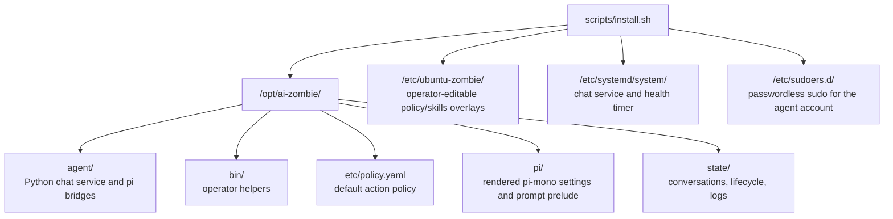

# Architecture

Ubuntu Zombie is a local-only AI Systems Administrator for Ubuntu
Desktop LTS. The installer creates a dedicated Linux account, installs a
small Python chat service, renders pi-mono runtime configuration, and
runs everything behind a local policy gate and audit log.

## Installed shape


```mermaid
flowchart TD
    installer["scripts/install.sh"]
    installer --> opt["/opt/ai-zombie/"]
    opt --> agent["agent/<br/>Python chat service and pi bridges"]
    opt --> bin["bin/<br/>operator helpers"]
    opt --> etc["etc/policy.yaml<br/>default action policy"]
    opt --> pi["pi/<br/>rendered pi-mono settings and prompt prelude"]
    opt --> state["state/<br/>conversations, lifecycle, logs"]
    installer --> overlay["/etc/ubuntu-zombie/<br/>operator-editable policy/skills overlays"]
    installer --> systemd["/etc/systemd/system/<br/>chat service and health timer"]
    installer --> sudoers["/etc/sudoers.d/<br/>passwordless sudo for the agent account"]
```

The default install does **not** provision SSH, Tailscale, VNC, Docker,
graphical autologin, or GUI automation. The baseline product access
surface is the chat service on
`127.0.0.1:${ZOMBIE_CHAT_PORT:-7878}`. The independently managed Llama
product adds only a loopback listener on port `8080` when selected.

## Runtime components

- `server.py` serves the chat UI, session APIs, approval flow, health
  endpoints, model selection endpoints, and the authenticated
  server-sent-events stream used for live turn progress.
- `pi_mono.py` starts `pi-mono-bridge.mjs`, enforces turn timeouts, and
  returns structured events to the server. Optional bridge `token` and
  `progress` events are forwarded as live UI hints; the final persisted
  conversation remains authoritative.
- `tools.py` defines the closed tool registry: shell, filesystem,
  package, service, network status, skill loading, and the bounded
  `timer.reactivation` tool.
- `policy.py` classifies commands and tool calls before execution.
- `audit.py` writes JSON-lines audit records with secret redaction.
- `history.py` persists conversations, tool events, and the single pending
  reactivation timer in SQLite.
- `lifecycle.py` enforces the Time to Live state.

## Trust boundaries

1. The browser talks to the loopback chat service.
2. The server sends prompts to the configured LLM provider through
   pi-mono.
3. Proposed tool calls pass through schema validation and policy
   classification.
4. Elevated actions require the configured approval path before running.
5. Every decision and tool result is audit-logged.

The local agent account has passwordless sudo by design. The policy gate
and audit trail are the runtime safety boundary; they do not make the
agent account unprivileged.

## Chat turn transport

The browser normally asks `POST /api/message` for a streaming turn. The
server validates the prompt and TTL, registers an opaque `turn_id`, starts
the model turn in a worker thread, and returns immediately. The browser
then opens `GET /api/stream/{turn_id}` with `EventSource`; the endpoint is
behind the same session-cookie gate as the JSON APIs and is not public.

The stream is one-way SSE over the existing loopback `ThreadingHTTPServer`
and carries a small vocabulary:

| Event | Purpose |
| ----- | ------- |
| `phase` | Coarse turn state such as model work or finalising. |
| `token` | Best-effort assistant text deltas from the bridge. |
| `tool_start` / `tool_end` | Live tool activity from the same paths that write history/audit records, or display-only pi built-in tool progress. |
| `pending_approval` | An elevated call has entered the operator approval queue. |
| `turn_done` | The exact final JSON payload the synchronous path returns. |
| `turn_error` | Provider, bridge, TTL, or stream setup failure. |

Clients that omit `stream: true`, lack `EventSource`, or lose the stream
fall back to the original synchronous JSON response or a conversation
reload. Closing the stream does not cancel the server-side turn; history
and the audit log continue to be written and can be reloaded later.

## Tool policy

Action classes are:

| Class | Meaning |
| ----- | ------- |
| `read_only` | Inspection only; can auto-run. |
| `chat_schedule` | Bounded scheduling of one visible future chat turn; can auto-run. |
| `user_change` | Changes within user-owned state. |
| `system_change` | Package, service, or privileged file mutation. |
| `network_change` | Firewall or interface mutation. |
| `destructive` | Irreversible actions; requires the confirmation phrase. |

Built-in skills ship under `/opt/ai-zombie/skills/` and cover `ai-agents`,
`apt`, `backup`, `certificates`, `containers`, `css`, `database`,
`desktop`, `dev`, `disk`, `files`, `forgejo`, `git`, `hardware`,
`hermes-agent`, `html`, `journal`, `json`, `kernel`, `llm`, `locale`,
`network`, `obsidian`, `openclaw-agent`, `packages`, `performance`,
`pi-mono-agent`, `process`, `reactivation`, `scheduling`, `secrets`,
`security`, `services`, `snap`, `sql`, `systemd`, `troubleshoot`,
`ubuntu`, `users`, `virtualization`, `web`, `zombie` and `zram`.
Each brief steers the
model toward the correct typed tool and names the policy class the
operator is about to be asked to approve; skills never expand the tool
registry. Trigger words are unique across the built-in catalogue so a
prompt loads only the briefs that apply. Operators may add local skill
briefs under `/etc/ubuntu-zombie/skills.d/`.

## Agent reactivation

`timer.reactivation` lets pi schedule one future continuation in the same
conversation. The server stores a single global pending timer in
`conversations.db`; a new request must explicitly replace the existing one.
Structured agent requests are stripped from the visible reply wherever they
appear (the last one wins), validated against the closed tool schema and
`chat_schedule` policy class, then dispatched to the timer runtime.
A server-owned timer thread re-reads the durable record after each sleep,
skips conversations that already have a turn in flight, atomically claims a due
record, checks the TTL and conversation, and starts an ordinary turn with fresh
policy decisions. It never executes a tool directly or carries an approval into
the new turn.

The authenticated UI polls the pending state, shows its reason, prompt preview,
and fire time, and gives the operator a cancel control. The injected user
message is marked `auto_reactivation` in history and rendered as queued by the
timer. Scheduling, replacement, cancellation, deferral, firing, chain depth,
and failure are written to the audit log; a continuation the daemon refuses to
run also appears in the transcript and in the last-outcome report returned by
`/api/reactivation`.

The operator can reset this mechanism with `/reactivation reset`. The reset
atomically restores the default enabled state and delay bounds, retires the
queued timer, requests cancellation of any active continuation, and advances a
durable reset timestamp so pre-reset outcomes and chain counts do not leak into
the current UX. Historical timer rows and audit evidence are retained.

## Optional components

The installer uses the component-aware grammar `scripts/install.sh <verb>
[component ...] [flags]`. Public compatibility targets currently are
`zombie` (the baseline account, runtime, chat UI, policy, and services),
`forgejo`, `forgejo-runner`, and `llama`. The runner target depends on
`forgejo`, so installing it converges the server before registering and
starting the runner. The legacy `ZOMBIE_INSTALL_*` flags remain supported and
are additive with explicit targets; all default to `0`.

Forgejo and Llama server operations delegate to independently versioned
lifecycles under `products/forgejo/` and `products/llama/` (or their installed
management entry points). The root installer retains target selection,
compatibility inputs, summary/receipt integration, and component-manifest
references; it contains no server mutation implementation. Zombie and the
not-yet-extracted Forgejo Runner retain installer-owned hooks.

The independent **Forgejo server** is a PostgreSQL-backed git forge running as
the dedicated `git` account under a hardened `forgejo.service`. It owns its
complete lifecycle, `/opt/forgejo`, `/etc/forgejo`, `/var/lib/forgejo`,
`/var/log/forgejo`, one exact Caddyfile block, its Avahi advertisement, and
the exported and host-trusted public CA copies. The Forgejo process is
loopback-only; Caddy is the **network-listening service** on HTTPS port `443`.
Secrets remain in `/etc/forgejo/app.ini` (`root:git`, `640`) and do not enter
common lifecycle responses, receipts, or audit events.

The optional co-located Actions runner remains a separate compatibility
component (`ZOMBIE_INSTALL_FORGEJO_RUNNER`) with its own `forgejo-runner`
account and restricted Docker executor. Job containers use host networking
to reach the loopback Caddy edge, an explicit `.local` host mapping rather
than image-specific mDNS, and a read-only host CA bundle with Git, OpenSSL,
Python, and Node trust variables. Privileged containers, workflow-supplied
host volumes, the job Docker socket, and the all-interface cache proxy remain
disabled. The runner process itself has root-equivalent Docker daemon access,
so it remains suitable only for trusted repositories. Forgejo lifecycle
mutations coordinate a present runner and refuse server removal until the
dependent runner is removed.

The policy gate still classifies interactive forge administration
(`forgejo`, `forgejo-runner`, `psql`, `createdb`) as `system_change` and
database drops (`dropdb`/`dropuser`/`DROP DATABASE`) as `destructive`.

The independent **Llama** infrastructure product has no dependency on
`zombie`. It owns the pinned upstream CPU runtime under `/opt/llama.cpp`, the
verified model under `/var/lib/llama.cpp`, fixed configuration under
`/etc/llama.cpp`, and a hardened `llama-server.service` running as the
non-login `llama-cpp` account. Its OpenAI-compatible listener is fixed to
`127.0.0.1:8080`; it is intentionally available PC-wide to local users but
never LAN-facing. `/usr/local/sbin/llama-manage` is the complete lifecycle
entry point; `/usr/local/bin/llama-manager` is the restricted runtime helper.
The product refuses to adopt paths, accounts, units, ports, models, or runtime
trees unless its product marker or the exact supported legacy installation
validates.

Chat `/locals` discovery scans the configured LM Studio port across the
local `/24`, plus loopback-only probes for the managed standalone port
`8080` and reserved private port `58080`. The additional probes do not
widen the LAN scan.

## Installer command grammar

```text
scripts/install.sh <verb> [component ...] [flags]
```

| Verb | Behaviour |
| ---- | --------- |
| `install` | Idempotent install. With no target, selects `zombie`. |
| `verify` | Read-only state check. |
| `doctor` | Explain failures and likely fixes. |
| `repair` | Re-assert permissions, re-render runtime config, redeploy skills, restart chat. |
| `uninstall` | Delegate to `scripts/uninstall.sh`; explicit targets remove the selected component, while no target removes all managed components. |

`install forgejo` and `install forgejo-runner` are standalone paths: they
create neither the zombie account nor `/opt/ai-zombie`, and they do not
deploy Node, the Python agent runtime, policy, audit, chat, or
desktop-availability settings. The runner target selects Forgejo as its
required component dependency.
`install forgejo` and `install llama` are compatibility paths to their
independent product lifecycles and likewise do not select or modify Zombie.
Installer-owned transcript and receipt records remain under `/var/log/`.

## Component manifest

Installed components are tracked independently under
`/var/lib/ubuntu-zombie/components/`. This directory is intentionally
outside `/opt/ai-zombie`, so selective zombie removal does not erase the
manifest entry for a remaining component such as Forgejo.

Manifest files use a fixed format-version-`1` key/value layout:
`format=`, `component=`, `ubuntu_zombie_version=`, `converged_utc=`,
`component_version=`, and `suboptions=`. They are parsed as data, never
sourced. Malformed or unknown entries are skipped.

A component entry is written only after that component's install has
completed successfully and passed its health checks. It is removed only
after that component's uninstall completes successfully; if cleanup for a
component fails, its manifest entry is retained so later lifecycle
commands can see that the component still needs attention.

## Logs and state

| Path | Purpose |
| ---- | ------- |
| `/var/log/ubuntu-zombie-install.log` | Installer transcript. |
| `/var/log/ubuntu-zombie/install-receipt.txt` | Non-secret install receipt. |
| `/var/log/ubuntu-zombie/audit.log` | JSON-lines audit trail. |
| `/opt/ai-zombie/state/conversations.db` | Chat history. |
| `/opt/ai-zombie/state/lifecycle.json` | TTL/tombstone state. |
| `/opt/ai-zombie/state/logs/` | pi-mono bridge logs. |
