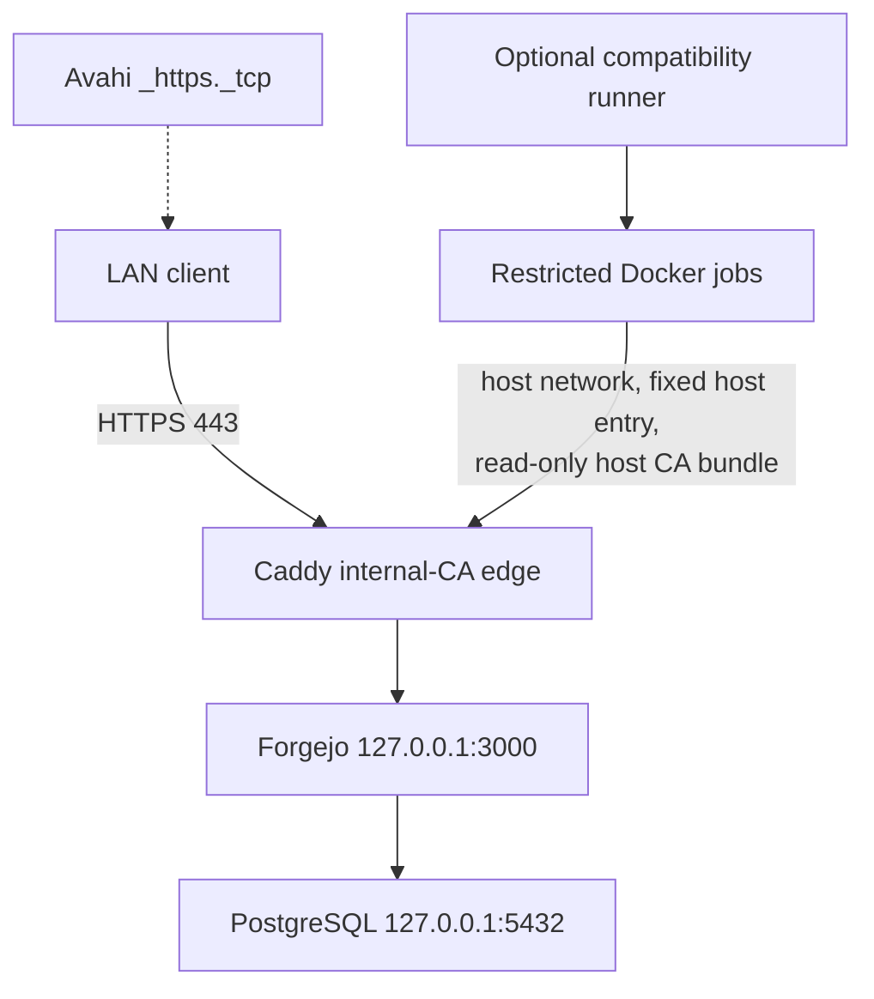

# Forgejo compatibility path

Forgejo is now an independently versioned infrastructure product under
`products/forgejo/`. Its complete lifecycle, architecture, configuration,
recovery, security, testing, and release documentation lives there.

Ubuntu Zombie keeps these compatibility commands:

```bash
sudo ./scripts/install.sh install forgejo
sudo ./scripts/install.sh verify forgejo
sudo ./scripts/install.sh doctor forgejo
sudo ./scripts/install.sh repair forgejo
sudo ./scripts/install.sh uninstall forgejo
```

Install, verify, doctor, and repair delegate to the same lifecycle exposed by
`/usr/local/sbin/forgejo-manage`. The shim preserves existing environment
inputs, component selection, receipts, and manifests, but does not contain a
second Forgejo server implementation.

An exact former component installation can be adopted without moving its
PostgreSQL database, repositories, LFS data, secrets, service identity, public
URL, or Caddy CA. Ambiguous state fails before mutation. See
`products/forgejo/docs/INSTALLATION.md`.

## Resulting boundary



The product owns the server, database, one exact Caddyfile block, Avahi
advertisement, local CA export and host trust, binary, systemd unit, backup,
and audit/receipt lifecycle. It does not own Docker or the Actions runner.

## Same-host runner

`forgejo-runner` remains a root compatibility component until its own roadmap
extraction. It depends on Forgejo and is installed after the server is
healthy. Registration uses the loopback HTTP URL. Jobs use the public HTTPS
URL, so the managed runner configuration supplies:

- `container.network: host`;
- a fixed `.local` mapping to `127.0.0.1`, avoiding container mDNS variance;
- a read-only mount of `/etc/ssl/certs/ca-certificates.crt`;
- `SSL_CERT_FILE`, `GIT_SSL_CAINFO`, `REQUESTS_CA_BUNDLE`, and
  `NODE_EXTRA_CA_CERTS`;
- `privileged: false`, `valid_volumes: []`, and `docker_host: "-"`; and
- a disabled all-interface cache proxy.

Host networking lets jobs reach other loopback services, and the runner
process has root-equivalent Docker daemon access. Enable it only for trusted
repositories and maintainers.

Forgejo backup, repair, update, rollback, suspend, and removal coordinate an
installed runner. Server removal fails while runner resources remain; the
root compatibility uninstaller removes the runner first.

## Direct product lifecycle

```bash
products/forgejo/scripts/manage.sh install --dry-run
sudo products/forgejo/scripts/manage.sh install --yes
sudo forgejo-manage backup --yes
sudo forgejo-manage update --yes
sudo forgejo-manage rollback --yes
sudo forgejo-manage suspend --yes
sudo forgejo-manage resume --yes
sudo forgejo-manage uninstall --yes
```

Direct uninstall retains repository, database, and recovery state. Complete
deletion requires:

```bash
sudo forgejo-manage uninstall --yes --purge \
  --confirmation "DELETE FORGEJO STATE"
```

Start with `products/forgejo/README.md` and
`products/forgejo/docs/CONFIGURATION.md`.
