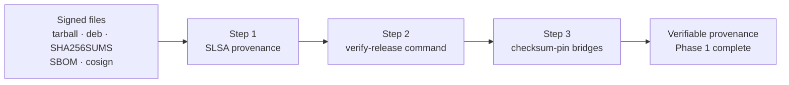
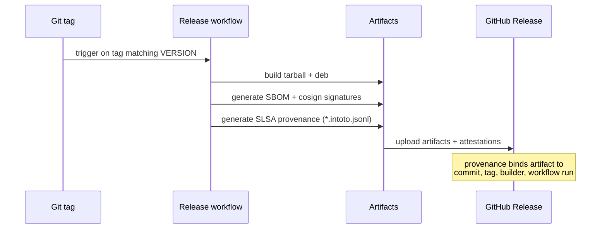
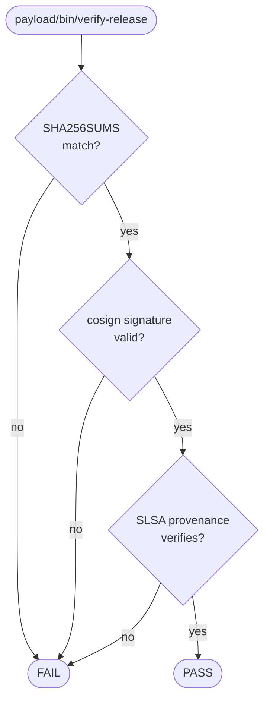
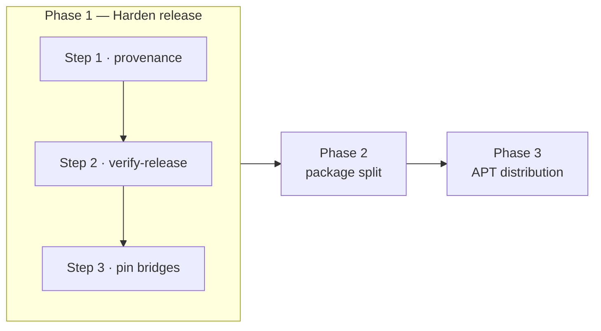

# Release Plan 123 — the next 3 best steps

Derived from [`docs/research/RELEASE-FUTURE.md`](docs/research/RELEASE-FUTURE.md).

The research doc's strategic call is to make Ubuntu Zombie a
**trustworthy, upgradeable, provenance-verifiable release system**
rather than chasing more packaging formats. Its roadmap opens with
**Phase 1 — Harden current release**.

The release already ships a tarball, `.deb`, `SHA256SUMS`, an SPDX
SBOM, and keyless cosign signatures, and the workflow already refuses
to publish when the Git tag does not match `VERSION`
(`.github/workflows/release.yml`, `RELEASE.md`). The three steps below
are the highest-value moves that move the release from "signed files"
to "verifiable provenance".

---

## Step 1 — Add build provenance attestation (SLSA)

**Why:** Section 4 of the research. Checksums and signatures prove an
artifact was *signed*, not that it was *built from this commit, by this
workflow, from this tag*. SLSA provenance closes that gap and is the
single biggest jump in supply-chain posture.

**Outcome:**
- Every release artifact gains a provenance attestation
  (`*.intoto.jsonl`) binding it to the source commit, tag, builder, and
  release workflow.
- Provenance is generated in the release workflow alongside the existing
  SBOM and cosign signing, and uploaded to the GitHub Release.
- The release bundle matches the "minimum best-in-class" list in the
  research doc.

**Done when:** a consumer can independently verify the provenance of any
published `.deb`/tarball back to its tag and workflow run.

---

## Step 2 — Ship a release verification command

**Why:** Phase 1 and Section 4 both call for a "release verification
command". Provenance and signatures are only class-leading if a consumer
can verify them in one step, including offline/air-gapped.

**Outcome:**
- A first-class verification entry point (`payload/bin/verify-release` in
  the release bundle) that, given the downloaded artifacts, checks:
  `SHA256SUMS`, cosign signatures, and the SLSA provenance attestation
  from Step 1.
- Documented in `RELEASE.md` and the upgrade docs, with an offline
  verification path.

**Done when:** a fresh download can be verified end-to-end with a single
documented command and clear pass/fail output.

---

## Step 3 — Checksum-pin the Node bridge inputs

**Why:** Section 6 flags `pi-ai.version` and `pi-mono.version` as the
remaining supply-chain gap. Release builds must not fetch mutable bridge
assets without enforcement.

**Outcome:**
- Each bridge dependency is pinned with name, version, source URL,
  SHA256, and license metadata.
- The build verifies the checksum and **fails closed** on mismatch.
- The pinned bridge inputs are reflected in the SBOM.

**Done when:** a tampered or drifted bridge asset aborts the release
build instead of being published.

---

## Sequencing note

These three steps are independent enough to land as separate PRs, but
their natural order is **1 → 2 → 3**: provenance gives the verification
command (Step 2) something authoritative to check, and bridge pinning
(Step 3) then ensures the inputs feeding that provenance are themselves
trustworthy. Together they complete Phase 1 of the roadmap and set up the
package split (Phase 2) and APT distribution (Phase 3).

