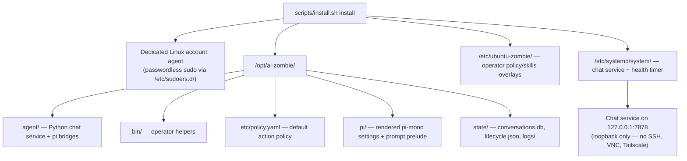
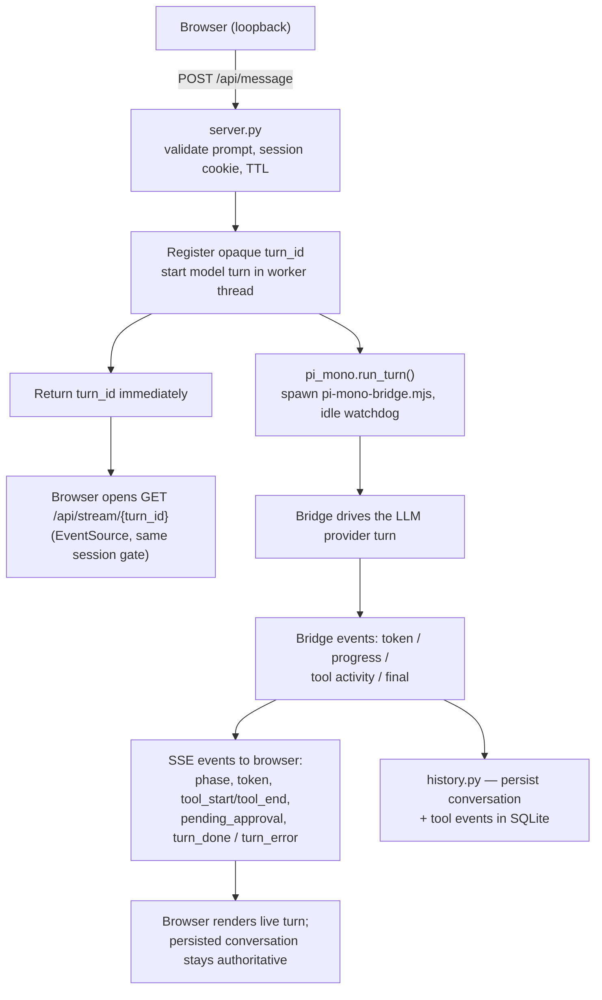
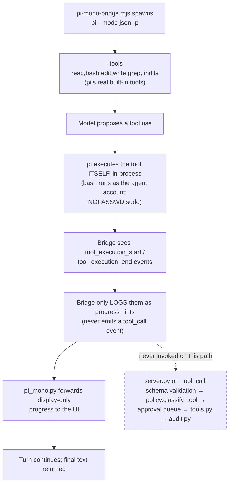
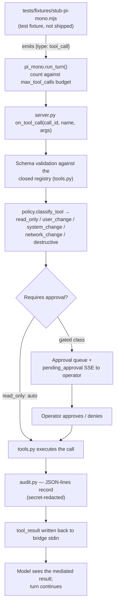
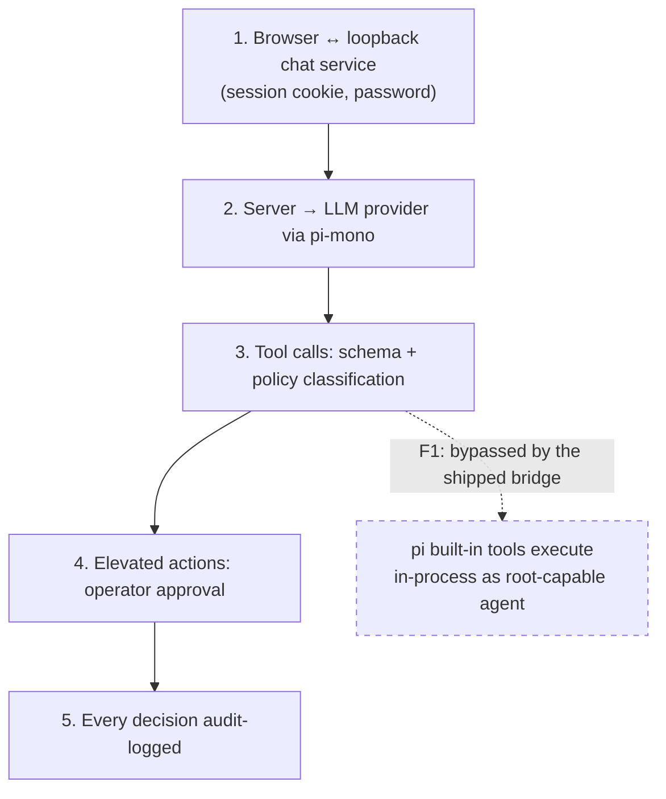

# Current state — how Ubuntu Zombie works now

Vertical Mermaid diagrams of the system as shipped today. The key
fact, established by `docs/analysis/improvements-8.md` (finding F1),
is that the production bridge runs pi's built-in tools **in-process**,
so the Python mediation pipeline (schema validation → policy
classification → approval queue → audit) is never invoked on the
shipped path. Diagrams 3 and 4 show the two paths side by side.

## 1. Installed shape

What `scripts/install.sh install` puts on the machine.

## 2. A chat turn, end to end

The transport described in `docs/ARCHITECTURE.md` ("Chat turn
transport"). This part works the same before and after mediation.

## 3. Shipped tool execution path (unmediated)

What actually happens when the model uses a tool today
(`payload/agent/pi-mono-bridge.mjs` + finding F1). The policy gate is
on the diagram only to show that it is **not** on the path.

Consequences (unenforced on this path):

- `max_tool_calls` and elevated-call budgets
- the destructive-confirmation phrase
- `payload/agent/tools.py` path allow-lists
- per-command audit records

## 4. Where the mediation plumbing runs today (stub only)

The full pipeline exists and is exercised — but only by
`tests/fixtures/stub-pi-mono.mjs`, never by the production bridge
(finding F2).

## 5. Trust boundaries as they stand

The documented boundary list versus reality: boundary 3–5 hold only on
the stub path.

