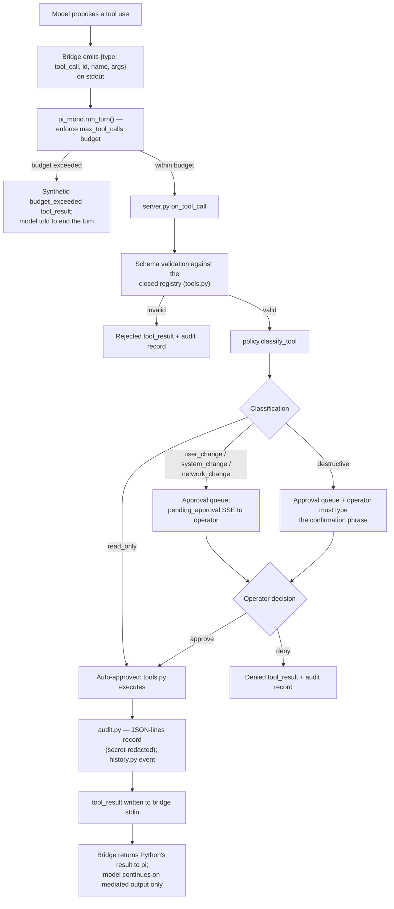
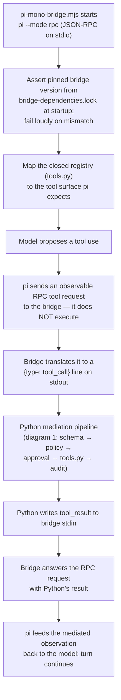
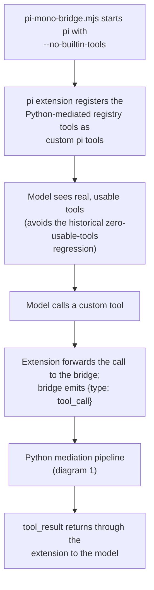
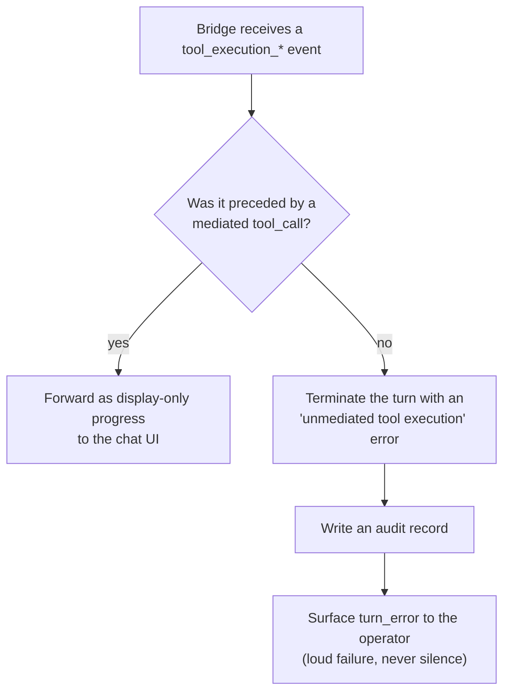
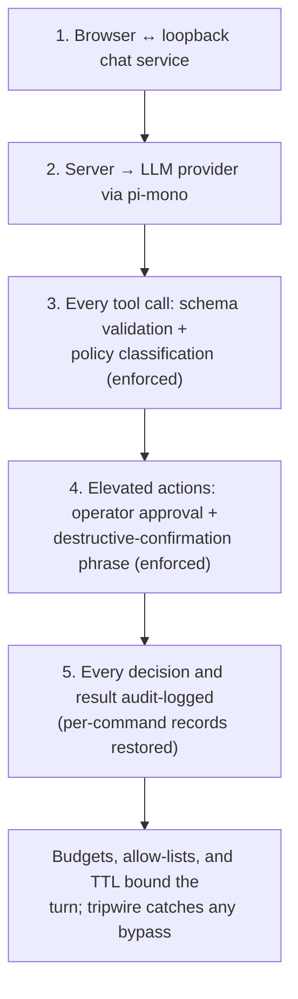

# Mediation — the restored tool-call gate

Vertical Mermaid diagrams of the mediated design from
`docs/analysis/improvements-8-plan.md` (phase 1). The invariant both
remediation shapes restore is:

> every tool execution round-trips through `on_tool_call`.

They differ only in *where* tool execution lives. Nothing here is
implemented yet; the diagrams show the target shape.

## 1. Mediated tool-call lifecycle (the invariant)

Every tool use, regardless of remediation shape, follows this path —
the same pipeline that today only the stub exercises.

## 2. Option A (preferred) — move the bridge to `--mode rpc`

pi stops executing tools itself; the bridge relays each tool request
to Python and blocks until Python answers.

## 3. Option B (interim) — `--no-builtin-tools` + custom pi tools

A hard stop that keeps the model usable: pi's built-ins are disabled
and the registry tools are re-registered as extension-defined custom
tools that round-trip through Python.

## 4. Tripwire — no silent unmediated execution

Work item 4 of phase 1: log-only handling of `tool_execution_*`
events is removed or converted into a loud failure.

## 5. Trust boundaries once mediation lands

The five documented boundaries all hold on the production path, and
the system prompt no longer encourages direct sudo use.

## Acceptance criteria (from the plan)

- A live turn on the **real** bridge produces, for every tool
  execution: a schema-validated `tool_call`, a policy classification,
  an audit record, and (for gated classes) an approval round-trip.
- `max_tool_calls`, the elevated-call budget, the
  destructive-confirmation phrase, and the `tools.py` path
  allow-lists are demonstrably enforced on the production path.
- The tripwire converts any unmediated execution into a loud turn
  failure rather than silence.
