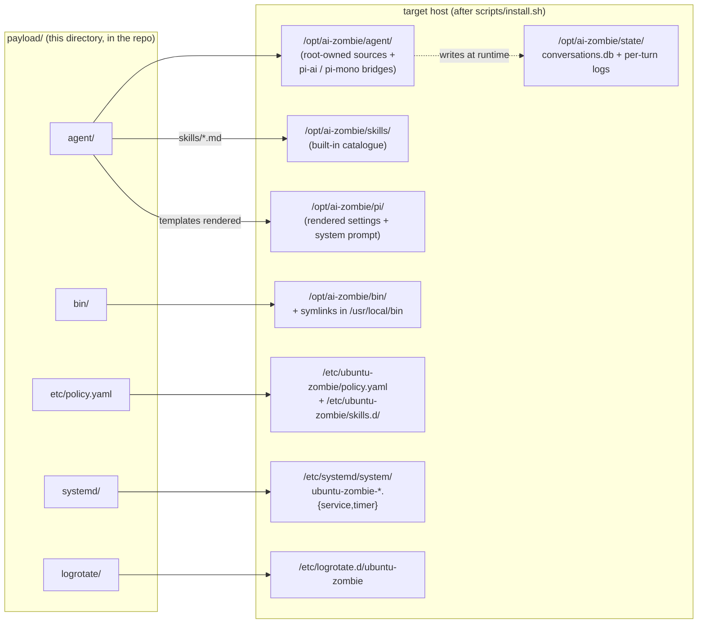
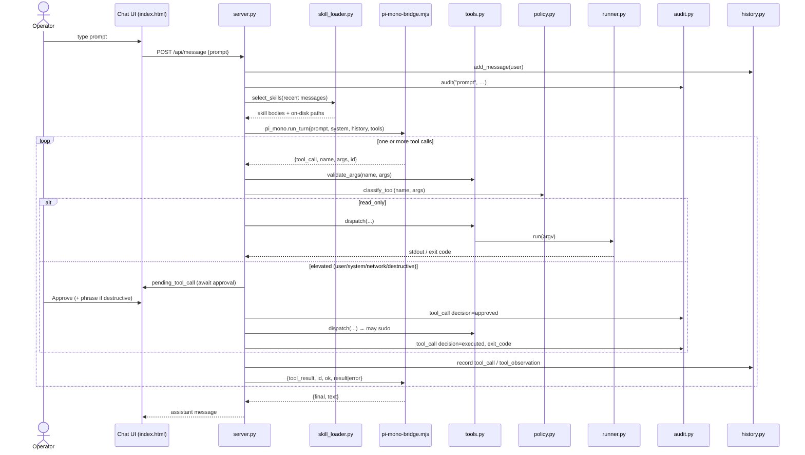
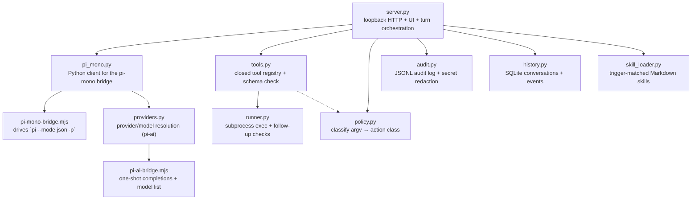
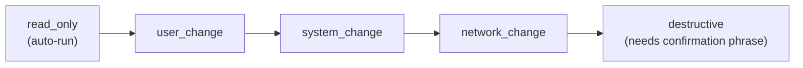

# The payload

This directory is **the product**. Everything outside it
(`scripts/install.sh`, the `Makefile`, the tests, the docs) exists to
*deliver*, *verify*, or *explain* what lives here. The payload is the
set of files that `scripts/install.sh` copies onto a target Ubuntu
Desktop LTS machine to turn it into an Ubuntu Zombie: a private,
loopback-only AI Systems Administrator that can act as `root` through a
classify → propose → approve → run → log gate.

If you want the one-sentence version: **the payload is the running
body of the zombie; `scripts/install.sh` is the ritual that animates
it.** This document explains the body part by part.

For the wider trust model and layer diagram, read
[`../docs/ARCHITECTURE.md`](../docs/ARCHITECTURE.md). For the rules an
agent must follow when changing these files, read
[`../AGENTS.md`](../AGENTS.md).

---

## Where it lands on the target

The installer is the only thing that reads this tree. It copies each
sub-directory to a fixed location, owned by `root` or by the
operator-chosen `AGENT_USER` (default `agent`), with explicit modes.
Nothing here is executed from the repository on the target — it is
*deployed* first, then run from its destination.

Placeholders such as `__AGENT_USER__`, `__ZOMBIE_DIR__`, and
`__AGENT_HOME__` in the `systemd/` and `logrotate/` files are
substituted by the installer so the deployed units name the
operator-chosen account and paths.

| Source                         | Destination                              | Owner / mode (typical) |
|--------------------------------|------------------------------------------|------------------------|
| `agent/*.py`, `agent/*.mjs`    | `/opt/ai-zombie/agent/`                  | `AGENT_USER` 644       |
| `agent/templates/*`            | `/opt/ai-zombie/agent/templates/` + rendered into `/opt/ai-zombie/pi/` | mixed |
| `agent/skills/*.md`            | `/opt/ai-zombie/skills/`                 | `root` 644             |
| `bin/*`                        | `/opt/ai-zombie/bin/` (+ `/usr/local/bin` symlinks) | `AGENT_USER` 755 |
| `etc/policy.yaml`              | `/etc/ubuntu-zombie/policy.yaml`         | `root` 644 (preserved if present) |
| `systemd/*`                    | `/etc/systemd/system/`                   | `root` 644             |
| `logrotate/ubuntu-zombie`      | `/etc/logrotate.d/ubuntu-zombie`         | `root` 644             |

---

## The runtime, end to end

The heart of the payload is the chat service in
[`agent/server.py`](agent/server.py). It binds **`127.0.0.1` only**,
serves a single-page UI, and drives the `pi-mono` agent loop
(`@earendil-works/pi-coding-agent`) through a Node bridge. The model
never emits free-form shell: every action is a structured **tool call**
against the closed registry in [`agent/tools.py`](agent/tools.py).
Read-only tools run inline; anything that mutates the host is queued
for explicit operator approval and only then dispatched — with the
decision written to the audit log *before* `sudo` is ever invoked.

The four invariants that make this safe — and that any change to this
directory must preserve — are:

1. **Loopback only.** The server binds `127.0.0.1`. There is no remote
   API surface.
2. **Closed tool surface.** `TOOL_REGISTRY` in `agent/tools.py` is the
   only set of tools that can ever run. Adding one requires a code
   release; skills, prompts, and `policy.yaml` cannot expand it.
3. **Policy gate + approval.** Every mutating call is classified by
   `agent/policy.py` and must be approved by the operator (destructive
   actions need a confirmation phrase).
4. **Everything is audited.** `agent/audit.py` writes one redacted
   JSON object per line for every prompt, decision, command, and
   result.

---

## `agent/` — the chat service

A small, dependency-light Python service plus two Node bridges. No
third-party Python packages beyond what the installer already provides;
the standard library does the rest.

| File | Responsibility |
|------|----------------|
| [`server.py`](agent/server.py) | Loopback HTTP server, single-page UI, REST endpoints (`/api/message`, `/api/version`, `/api/models`, …), per-turn orchestration, approval queue, refuses to start if `secrets/env` is group/world-readable. |
| [`pi_mono.py`](agent/pi_mono.py) | Python client for the `pi-mono` bridge; speaks a line-delimited JSON protocol over stdio and enforces a per-turn idle watchdog. |
| [`pi-mono-bridge.mjs`](agent/pi-mono-bridge.mjs) | Node bridge that runs the `pi` agent loop one-shot (`pi --mode json -p`) with pi's real built-in tools, parsing `message_update` / `message_end` / `agent_end` events. |
| [`pi-ai-bridge.mjs`](agent/pi-ai-bridge.mjs) | Node bridge over `@earendil-works/pi-ai` for one-shot `complete()` calls and live model listing (e.g. for the `/model` command). |
| [`providers.py`](agent/providers.py) | Single source of truth for provider + model selection, resolved from `ZOMBIE_PROVIDER`, `ZOMBIE_MODEL`, and the matching `*_API_KEY`. |
| [`tools.py`](agent/tools.py) | The **closed** tool registry, a tiny dependency-free schema validator, and the dispatcher that wraps existing helpers (`runner.run`, `Path.read_text`, …). |
| [`policy.py`](agent/policy.py) | Argv-aware classifier that reads `policy.yaml` live; fail-closed for unknown commands, with a `sudo` allow-list to keep common privileged targets at `system_change`. |
| [`runner.py`](agent/runner.py) | Command execution with timeout and stdout/stderr/exit capture, plus suggested read-only follow-up checks. |
| [`audit.py`](agent/audit.py) | Append-only JSON-lines audit log with secret redaction and SHA-256 digests of tool output. |
| [`history.py`](agent/history.py) | SQLite-backed conversations and structured `tool_call` / `tool_observation` events; forward-only schema via `PRAGMA user_version`. |
| [`skill_loader.py`](agent/skill_loader.py) | Selects trigger-matched Markdown skills and records their on-disk provenance; never expands the tool surface. |
| [`templates/`](agent/templates) | The chat UI (`index.html`) plus `settings.json.tmpl` and `APPEND_SYSTEM.md.tmpl`, rendered by the installer into `/opt/ai-zombie/pi/`. |
| [`skills/`](agent/skills) | Built-in skill catalogue (`apt`, `systemd`) — Markdown nudges toward the correct typed tool. |
| `pi-ai.version`, `pi-mono.version`, `bridge-dependencies.lock` | Pinned versions and checksums for the Node bridge dependencies. |
| [`examples.md`](agent/examples.md) | Example operator prompts surfaced in the UI. |

### Action classes

`policy.py` sorts every command into one of five ordered classes. Only
`read_only` runs without an approval prompt.

---

## `bin/` — operator helpers

Bash helpers a human operator runs directly (several are symlinked onto
`PATH` by the installer). They follow the repository's best-effort
convention: under `set -euo pipefail`, every external command in a
diagnostic helper is guarded so one failure does not abort collection.

| Helper | Purpose |
|--------|---------|
| [`zombie-chat`](bin/zombie-chat) | Print the chat URL, an SSH-tunnel example, and every debugging entry point — the single command to discover the diagnostic surface. |
| [`health-check`](bin/health-check) | One-shot health summary (also run periodically by the health timer). |
| [`audit-recent`](bin/audit-recent) | Pretty-print recent audit-log entries (`-n`, `--all`, `-t TYPE`, `--follow`). |
| [`collect-diagnostics`](bin/collect-diagnostics) | Bundle logs and state into a tarball for bug reports, redacting secrets first. |
| [`secrets-edit`](bin/secrets-edit) | Safely edit `/opt/ai-zombie/secrets/env`, re-asserting `0600` and ownership on exit. |
| [`setup-agent-venv`](bin/setup-agent-venv) | Provision the unprivileged agent Python venv and Playwright/Chromium (run as the agent user, idempotent). |
| [`verify-release`](bin/verify-release) | Verify a downloaded release: `SHA256SUMS`, cosign signatures, and SLSA provenance. |

> ⚠️ **Do not run the mutating helpers** (`secrets-edit`,
> `setup-agent-venv`) or the installer outside a disposable Ubuntu
> Desktop LTS VM. They change real system state.

---

## `etc/policy.yaml` — the gate's configuration

The default policy file. It defines the `destructive_confirmation`
phrase, the fail-closed `default_class`, and the `sudo_allow_list` of
curated privileged targets that stay at `system_change` instead of
being escalated. It is read **live** on every classification, so an
operator can edit it without restarting the chat service. The installer
*preserves* an existing `/etc/ubuntu-zombie/policy.yaml` rather than
overwriting it.

To add a new policy class, follow the recipe in
[`../CONTRIBUTING.md`](../CONTRIBUTING.md): list it here, handle it in
`agent/policy.py`, and document it in
[`../docs/ARCHITECTURE.md`](../docs/ARCHITECTURE.md).

---

## `systemd/` — the units

| Unit | Role |
|------|------|
| `ubuntu-zombie-chat.service` | Runs `server.py` as `AGENT_USER` on `127.0.0.1:7878`. **Sandboxing is deliberately off** (`ProtectSystem=false`, no `NoNewPrivileges`): the agent is a full Systems Administrator that elevates via passwordless `sudo`, so a private mount namespace or `NoNewPrivileges` would break approved work. The policy gate — not a systemd sandbox — is the security boundary. |
| `ubuntu-zombie-health.service` | Oneshot wrapper around `bin/health-check`. |
| `ubuntu-zombie-health.timer` | Runs the health check every 15 minutes. |

---

## `logrotate/ubuntu-zombie` — log hygiene

Rotation rules for the audit log, the install log, and the per-turn
`pi-mono` logs under `/opt/ai-zombie/state/logs/`. The `__AGENT_USER__`
placeholder is substituted at install time so rotated files are
re-created with the operator-chosen owner.

---

## Extending the payload

Three extension points have fixed recipes in
[`../CONTRIBUTING.md`](../CONTRIBUTING.md); follow them literally
because they encode runtime invariants:

- **New LLM provider** → implement `BaseProvider` in
  `agent/providers.py`, register it in `provider_from_env()`, document
  its env vars, and add an import smoke test.
- **New policy class** → `etc/policy.yaml` + `agent/policy.py` +
  `docs/ARCHITECTURE.md`.
- **New installer subcommand** → `scripts/install.sh` + `README.md`
  Subcommands block + the `subcommands` case in `tests/smoke.sh`.

Always run `make lint` and `make test` after changing anything here;
both are the same checks CI runs. Never add a new runtime dependency
outside the set the installer already installs, never let a new code
path reach `sudo` without a matching policy class and audit entry, and
never commit secrets.
